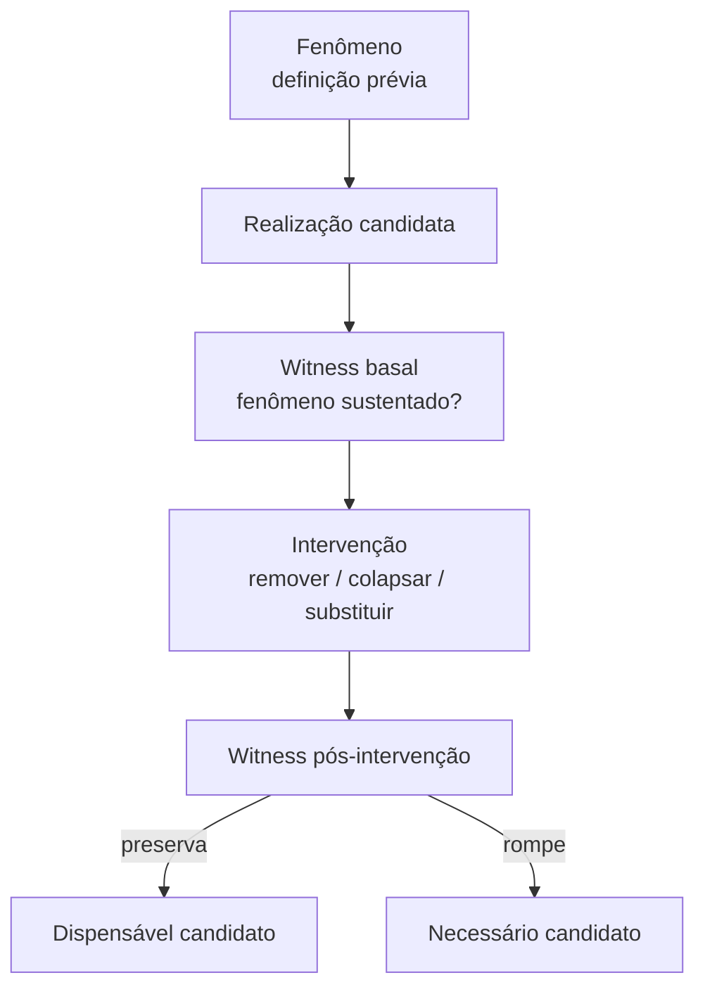
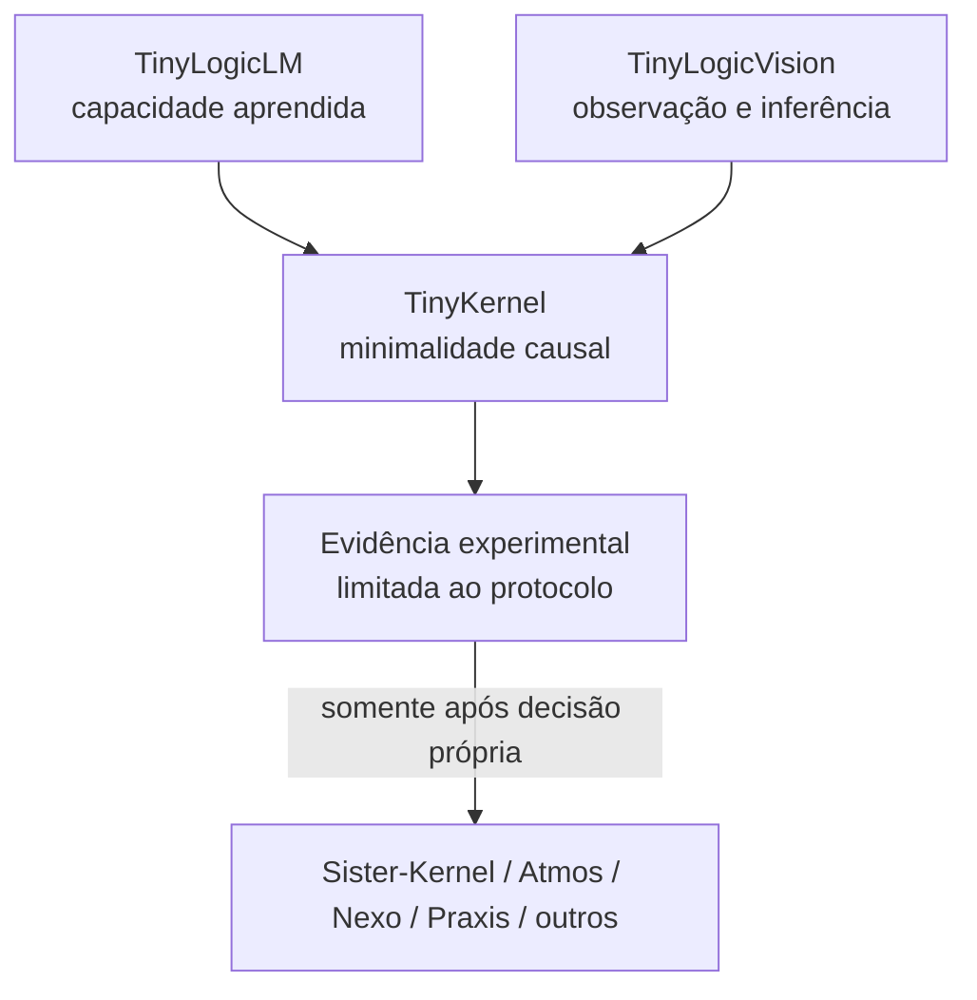

**TinyKernel**

Família experimental TinyLogic

**Fundamentos para uma Ciência Experimental da Minimalidade Causal**

Do “menor conjunto de componentes” ao “menor circuito causal que preserva um fenômeno”

**Proposição de partida.** Encontrar um Kernel não consiste em escolher antecipadamente seus componentes, mas em remover abstrações até que uma remoção adicional destrua causalidade, significado ou capacidade.

|           |                                    |
|:----------|:-----------------------------------|
| Documento | TK-FND-00                          |
| Versão    | 0.1.0                              |
| Status    | BASE FUNDADORA / PRÉ-IMPLEMENTAÇÃO |
| Autor     | José Pedro Trindade                |
| Data      | 09 de setembro de 2026             |

**Sempre pronto. Sempre incompleto.**

# Metadados e autoridade do documento

|                                         |                                                                                                                                      |
|:----------------------------------------|:-------------------------------------------------------------------------------------------------------------------------------------|
| **Projeto**                             | TinyKernel                                                                                                                           |
| **Documento**                           | TK-FND-00                                                                                                                            |
| **Versão**                              | 0.1.0                                                                                                                                |
| **Estado**                              | Base fundadora, pré-implementação, deliberadamente falsificável                                                                      |
| **Fonte primária**                      | Diálogo de pesquisa “Recuperar essência do Kernel”, consolidado em 09/09/2026                                                        |
| **Linhagem conceitual**                 | Sister-Kernel; TinyLogicLM; TinyLogicVision                                                                                          |
| **Objeto candidato**                    | Minimalidade causal                                                                                                                  |
| **Objeto que *não* deve ser presumido** | “Kernel” como entidade pronta, universal ou previamente definida                                                                     |
| **Autoridade de implementação**         | Nenhuma. Este documento não autoriza código nem experimento por si só                                                                |
| **Autoridade sobre Sister-Kernel**      | Nenhuma. Resultados de TinyKernel só podem ser transferidos posteriormente mediante evidência e decisão própria                      |
| **Status epistemológico**               | Hipóteses, definições operacionais candidatas, distinções e programa experimental; não contém resultados experimentais de TinyKernel |
| **Princípio operacional**               | **READY ≠ COMPLETE**                                                                                                            |

> **Leitura obrigatória**
>
> Este texto não deve ser usado como especificação de uma arquitetura que precisa ser confirmada. Sua função é construir um aparato suficientemente pequeno para que as próprias proposições aqui registradas possam falhar.
>
> Se o laboratório apenas reencontrar a teoria que o criou, ele terá produzido circularidade, não descoberta.

# Natureza deste documento

Este é o registro fundador do TinyKernel, um laboratório experimental proposto a partir de uma convergência entre três trajetórias:

1.  a busca do Sister-Kernel por um conjunto mínimo de primitivas, invariantes e mecanismos capazes de preservar identidade e evolução;

2.  a materialização, em TinyLogicLM, de uma cadeia inteira de aprendizado em escala humana;

3.  a extensão, em TinyLogicVision, da pergunta sobre aprendizado para a relação entre mundo observado, suporte, representação, inferência, decisão e proveniência.

A hipótese que nasce dessa convergência não é simplesmente que sistemas complexos possuem um “núcleo”. A hipótese mais forte é que talvez possamos investigar experimentalmente *o que precisa permanecer causalmente verdadeiro para que um fenômeno continue sendo reconhecível como ele mesmo*.

O laboratório existe para testar essa hipótese.

> **Tese de abertura**
>
> **Kernel não será tratado inicialmente como objeto dado.** O objeto científico do laboratório será a **minimalidade causal**. Um Kernel, se essa categoria sobreviver à investigação, será um resultado candidato obtido sob um fenômeno, contexto, família de intervenções e conjunto de testemunhos explicitados.

# A mudança de pergunta

A formulação inicial de Kernel tendia naturalmente a perguntas do tipo:

*Quais são as entidades mínimas?*  
*Quais são as relações mínimas?*  
*Quais são os invariantes mínimos?*

Essas perguntas continuam úteis, mas carregam uma premissa oculta: a de que o Kernel é uma coleção de coisas.

TinyLogicLM sugere uma pergunta mais fundamental:

> **Mudança central**
>
> Não perguntar primeiro **“qual é o menor conjunto de componentes?”**, mas:
>
> >
> **“qual é o menor circuito causal que ainda produz o fenômeno?”**
>
> 

Essa mudança desloca o foco de substantivos para relações e transformações.

Um Kernel pode conter componentes, mas sua identidade pode residir menos nos componentes isolados do que no fechamento causal entre eles.

# Linhagem: o que TinyLogic tornou visível

## TinyLogicLM: capacidade como fechamento causal

TinyLogicLM tornou observável, em uma escala em que cada etapa ainda podia ser inspecionada, uma cadeia do tipo:

    simbolo
    -> token
    -> representacao numerica
    -> transformacao
    -> resultado
    -> erro
    -> atribuicao do erro
    -> atualizacao
    -> comportamento posterior

O avanço conceitual relevante para TinyKernel não é a presença de Transformer, atenção, embedding, softmax ou SGD. Todos esses elementos podem ser realizações contingentes.

A questão mais profunda é:

**qual é o fechamento causal mínimo capaz de converter experiência em mudança persistente de comportamento?**

Uma abstração candidata é:

$$\text{estado}_t
\rightarrow
\text{ação}
\rightarrow
\text{consequência observável}
\rightarrow
\text{diferença}
\rightarrow
\text{atualização}
\rightarrow
\text{estado}_{t+1}.$$

Isso não define aprendizado. Define apenas uma estrutura candidata a ser testada.

## TinyLogicVision: o mundo entra no circuito

TinyLogicVision introduziu uma dificuldade adicional: antes de perguntar o que o modelo aprendeu, tornou-se necessário perguntar *o que exatamente foi observado e representado*.

A cadeia passou a admitir algo como:

    fenomeno
    -> observacao
    -> amostragem
    -> suporte
    -> representacao
    -> entrada
    -> transformacao
    -> decisao
    -> projecao

Dessa prática emergiram distinções importantes:

    SUPPORT != DECISION POINT
    DECISION POINT != DISPLAY CELL
    DISPLAY CELL != H3 CELL
    RGB PREVIEW != MULTISPECTRAL TENSOR
    H3 != RASTER

Essas desigualdades sugerem um princípio central para TinyKernel:

> **Princípio de não-colapso**
>
> Duas coisas computacionalmente intercambiáveis em uma implementação não são necessariamente semanticamente equivalentes no fenômeno investigado.
>
> Um sistema pode continuar executando e, ainda assim, ter perdido a causalidade ou o significado que legitimava sua saída.

# Hipótese central: minimalidade causal

Considere:

- $P$: um fenômeno explicitamente definido;

- $C$: o contexto no qual o fenômeno é observado;

- $R$: uma realização candidata;

- $W$: um conjunto de testemunhos (*witnesses*);

- $\mathcal{I}$: uma família de intervenções permitidas.

A notação inicial $K(P,C,W)$ é útil como intuição, mas deve ser refinada: o que observamos diretamente não é o fenômeno em si; observamos respostas dos testemunhos sobre uma realização submetida a um contexto e a intervenções.

Definimos provisoriamente:

$$W(R,C) = \text{evidência produzida pelos testemunhos sobre }R\text{ em }C.$$

Uma realização $R$ é **suficiente sob o protocolo** quando os testemunhos previamente definidos continuam sustentando a presença de $P$ no contexto $C$.

$$\operatorname{Suf}(R;P,C,W) = 1.$$

Para um elemento $e$ removível de $R$, definimos uma intervenção subtrativa:

$$\Delta^{-}_{e}(R) = R \setminus e.$$

Uma primeira noção de necessidade observada seria:

$$\operatorname{Nec}(e \mid R;P,C,W)
=
1
\quad\text{se}\quad
\operatorname{Suf}(R)=1
\;\land\;
\operatorname{Suf}(\Delta^{-}_{e}(R))=0.$$

## Uma correção importante: irredutível não é necessariamente mínimo

A expressão

$$\forall e\in R,\qquad
\operatorname{Suf}(R\setminus e)=0$$

mostra que $R$ é **1-irredutível**: nenhuma remoção unitária preserva o fenômeno sob o protocolo.

Ela **não prova** que $R$ seja a menor realização possível.

Pode existir outra realização $R'$ com menos elementos, ou uma realização com elementos diferentes, que preserve o mesmo fenômeno.

Portanto TinyKernel deve distinguir pelo menos:

Irredutibilidade local:  
nenhuma intervenção elementar autorizada preserva o fenômeno.

Minimalidade relativa:  
não encontramos realização menor dentro do espaço de busca examinado.

Minimalidade global:  
nenhuma realização possível é menor.

A terceira é, em geral, uma alegação muito mais forte e talvez inalcançável.

> **Regra epistemológica**
>
> TinyKernel não deve chamar uma realização de “Kernel mínimo” quando a evidência apenas demonstra irredutibilidade local.

# O problema do witness: não observar não significa que deixou de existir

Esta é uma das armadilhas mais importantes do programa.

Se uma intervenção faz o witness deixar de detectar o fenômeno, existem pelo menos duas interpretações:

1.  o fenômeno realmente foi destruído;

2.  a intervenção destruiu a capacidade do witness de observá-lo.

Logo:

$$W(P)=0 \;\not\Rightarrow\; P=0.$$

Da mesma forma:

$$W(P)=1 \;\not\Rightarrow\; P=1$$

sem que tenhamos alguma confiança na validade do witness.

Isso significa que o witness não é um acessório do experimento. Ele é parte do aparato epistemológico e também deve estar sujeito a teste.

## Triangulação mínima

Quando possível, o laboratório deverá empregar testemunhos de naturezas distintas:

- **witness operacional**: o sistema produz ou não uma saída?

- **witness causal**: a saída ainda depende da cadeia causal declarada?

- **witness semântico**: a saída ainda significa aquilo que o experimento afirma que significa?

- **witness temporal**: a propriedade sobrevive a uma transição de estado ou a uma interação posterior?

A existência de vários witnesses não produz verdade automática. Ela reduz a chance de confundir uma falha de observação com uma falha do fenômeno.

# Quatro tipos de ruptura

A versão inicial da ideia distinguia três rupturas: operacional, causal e semântica. A análise do papel do witness exige uma quarta.

| **Ruptura**                    | Definição operacional candidata                                                                                                                                      |
|:-------------------------------|:---------------------------------------------------------------------------------------------------------------------------------------------------------------------|
| **Operacional**                | A realização deixa de produzir o comportamento ou artefato observável requerido pelo fenômeno.                                                                       |
| **Causal**                     | A saída continua existindo, mas já não decorre da cadeia causal que fundamentava a alegação. O sistema “funciona”, porém por outra razão.                            |
| **Semântica**                  | A saída computacional permanece, mas uma distinção necessária para seu significado foi perdida. O valor existe; a interpretação que o legitimava, não.               |
| **Observacional / evidencial** | O fenômeno pode permanecer, mas a intervenção compromete o mecanismo utilizado para detectá-lo, medi-lo ou distingui-lo. A ausência observada torna-se inconclusiva. |

> **Consequência**
>
> **PASS de software não é witness suficiente de preservação de Kernel.** Uma intervenção pode preservar execução e destruir causalidade; preservar causalidade e destruir semântica; ou preservar o fenômeno e destruir somente nossa capacidade de observá-lo.

# O operador experimental fundamental: subtração

TinyLogicLM e TinyLogicVision foram construídos predominantemente por **materialização incremental**: adicionávamos somente aquilo que uma pergunta exigia.

TinyKernel acrescenta deliberadamente o movimento inverso:

$$\boxed{
\text{construir}
\;\longleftrightarrow\;
\text{remover}
}$$

A unidade experimental básica é:

A palavra **candidato** é obrigatória em ambos os ramos.

Remover algo sem observar perda não prova inutilidade universal. Romper algo após uma remoção não prova necessidade universal.

Cada resultado permanece limitado por $P$, $C$, $W$ e $\mathcal{I}$.

# Interações: por que remover uma coisa de cada vez pode enganar

Considere uma realização com dois mecanismos redundantes, $a$ e $b$.

$$R=\{a,b\}$$

Se retirarmos $a$, $b$ preserva o fenômeno. Se retirarmos $b$, $a$ preserva o fenômeno.

Testes unitários de ablação poderiam sugerir:

$$a\text{ é dispensável}
\qquad\text{e}\qquad
b\text{ é dispensável}.$$

Mas:

$$R\setminus\{a,b\}$$

pode destruir completamente o fenômeno.

Portanto necessidade pode ser **conjunta**, e redundância pode esconder causalidade.

Para uma intervenção sobre um subconjunto $S$ de elementos:

$$\Delta^{-}_{S}(R)=R\setminus S.$$

TinyKernel deverá começar com ablações simples, mas preservar desde o início a possibilidade de:

- remoções pareadas;

- remoções de grupos;

- substituições por realizações alternativas;

- colapso deliberado de distinções;

- mudança da ordem das transformações;

- intervenções temporais.

> **TK-MARKER-001 — Minimalidade combinatória \| OPEN**
>
> Uma realização pode parecer irredutível ou dispensável dependendo da granularidade das intervenções. Investigar como distinguir dependência elementar, dependência conjunta e redundância causal sem transformar o laboratório prematuramente em um buscador combinatório geral.

# Kernel não é implementação

Considere:

    Realizacao A:
    a -> b -> c

    Realizacao B:
    x -> y

Se ambas preservam o mesmo fenômeno sob o mesmo contexto e sobrevivem aos mesmos testes causais relevantes, talvez estejamos observando duas realizações de uma estrutura mais abstrata.

Isso sugere uma relação de equivalência experimental candidata:

$$R_1 \sim_{P,C,W,\mathcal{I}} R_2$$

quando $R_1$ e $R_2$ são indistinguíveis *para o fenômeno e protocolo explicitados*, não em sentido absoluto.

Essa equivalência é deliberadamente local.

Duas realizações podem ser equivalentes para uma pergunta e profundamente diferentes para outra.

## O espaço de realizações minimais

Pode haver:

$$K_1=\{A,B,C\}
\qquad\text{e}\qquad
K_2=\{A,X\},$$

ambos suficientes e localmente irredutíveis.

Nesse caso, o objeto de interesse deixa de ser “o Kernel” e passa a ser:

**o espaço de realizações causalmente minimais de um fenômeno sob um protocolo.**

Esse espaço pode conter famílias, equivalências, redundâncias, compensações e múltiplas formas de realizar a mesma capacidade.

> **TK-MARKER-002 — Pluralidade de Kernel \| OPEN**
>
> Testar se fenômenos simples admitem mais de uma realização irredutível não isomórfica. Se admitirem, abandonar qualquer pressuposto de unicidade do Kernel.

# Minimalidade causal versus minimalidade descritiva

Um sistema pode ter uma descrição curta e ainda conter causalidade supérflua. Outro pode exigir mais símbolos para descrever a mesma estrutura causal.

TinyKernel não deve confundir:

- menor número de linhas de código;

- menor número de classes;

- menor número de bytes;

- menor número de estados;

- menor descrição textual;

- menor estrutura causal suficiente.

Essas medidas podem ser correlacionadas em alguns experimentos, mas não são sinônimos.

> **TK-MARKER-003 — Unidade de complexidade \| OPEN**
>
> Que medida, se alguma, permite comparar a complexidade de realizações diferentes sem reificar escolhas de implementação? Contagem de componentes é suficiente apenas para experimentos extremamente controlados.

# O primeiro fenômeno não deve se chamar “aprendizado”

A formulação inicial de TK-0001 usava “persistência de aprendizado”. Isso carrega um problema: a palavra *aprendizado* já embute uma interpretação.

Para reduzir circularidade, o primeiro fenômeno deve ser mais fraco e diretamente observável.

> **Fenômeno TK-0001 — formulação recomendada**
>
> **Persistência adaptativa:** um sistema sofre uma experiência $E$, altera algum estado interno em função dessa experiência e, em uma interação posterior na qual $E$ não é reapresentada, produz um comportamento diferente do baseline em consequência daquela alteração persistida.

Isso não prova que o sistema “aprendeu”.

Permite perguntar depois:

*Que condições adicionais seriam necessárias para distinguir persistência adaptativa de memorização, ajuste, condicionamento ou aprendizado?*

Essa é precisamente a lógica do laboratório: começar com um fenômeno pequeno e deixar conceitos mais fortes emergirem apenas se a diferença se tornar necessária.

# TK-0000 e TK-0001: materialidade inicial

## TK-0000 — Bootstrap do aparato

TK-0000 não deve buscar um Kernel substantivo.

Seu único objetivo é provar que o laboratório consegue executar de forma reproduzível:

    baseline
    -> witness
    -> intervention
    -> witness
    -> classification

Critério de saída:

- build limpo;

- execução determinística;

- witness basal explícito;

- uma intervenção subtrativa trivial;

- restauração do baseline;

- resultado reproduzível;

- nenhum claim sobre minimalidade causal.

## TK-0001 — Persistência adaptativa

Uma realização inicial pode ser propositalmente banal:

$$s_0=0.$$

O sistema recebe uma experiência com um alvo $y\in\{0,1\}$, produz uma ação baseada em $s$, recebe informação sobre a diferença e atualiza $s$. Em uma interação posterior, sem reapresentar a experiência original, o comportamento deve refletir o estado alterado.

A realização candidata pode conter:

    estado
    -> entrada
    -> acao
    -> feedback
    -> diferenca
    -> atualizacao
    -> estado persistido
    -> interacao posterior

Intervenções iniciais candidatas:

| Intervenção                   | Previsão antes da execução                                      | O que a observação pode distinguir                                                                      |
|:------------------------------|:----------------------------------------------------------------|:--------------------------------------------------------------------------------------------------------|
| Remover atualização           | Experiência ocorre, mas não altera estado                       | Se mudança persistente exige atualização nesta realização                                               |
| Remover persistência          | Mudança pode ocorrer durante a interação, mas desaparece depois | Se o fenômeno definido exige continuidade temporal                                                      |
| Remover feedback              | Mudança pode ainda ocorrer por outra regra                      | Se feedback é necessário para persistência adaptativa ou apenas para uma classe específica de adaptação |
| Substituir feedback por ruído | O estado pode mudar sem se orientar pela experiência            | Se orientação por consequência precisa ser distinguida de mera mutação                                  |
| Colapsar estado e ação        | Pode preservar saída em um instante e perder memória causal     | Se estado independente é necessário para explicar persistência                                          |

> **Proibição de interpretação retroativa**
>
> Se TK-0001 mostrar que feedback não é necessário para o fenômeno definido, o resultado não deve ser “corrigido” redefinindo silenciosamente o fenômeno para fazer feedback parecer necessário.
>
> A definição prévia permanece registrada; uma definição sucessora deve receber outro experimento.

# Classificação experimental de resultados

Cada intervenção deverá produzir uma classificação limitada ao protocolo.

PRESERVED:  
os witnesses preregistrados sustentam que o fenômeno permanece.

BROKEN_OPERATIONAL:  
o fenômeno falha no nível operacional.

BROKEN_CAUSAL:  
a saída permanece, mas sua dependência causal requerida foi quebrada.

BROKEN_SEMANTIC:  
a saída permanece, mas a distinção semântica necessária foi perdida.

WITNESS_COMPROMISED:  
a intervenção impede conclusão porque afeta o aparato de observação.

INCONCLUSIVE:  
os dados não distinguem as alternativas definidas.

Nenhuma dessas classificações equivale automaticamente a:

`KERNEL_FOUND`

Essa etiqueta não deve existir nos primeiros experimentos.

# Da visão ao TinyKernel: intervenções semânticas futuras

TinyLogicVision sugere uma família especialmente fértil de experimentos: **colapso de distinções**.

Em vez de apenas apagar componentes, podemos tornar duas categorias indistinguíveis e observar se a alegação científica continua legítima.

Exemplos candidatos:

    support := decision_point
    preview_rgb := multispectral_tensor
    h3_cell := raster_support
    display_cell := observation_support

O objetivo não será verificar se o software continua executando.

Será verificar se:

1.  a cadeia causal continua reconstruível;

2.  a saída continua semanticamente atribuível à observação declarada;

3.  dois mundos materialmente diferentes continuam distinguíveis.

> **TK-MARKER-004 — Colapso semântico \| OPEN**
>
> Formalizar uma classe de intervenção em que nenhuma função é removida, mas duas distinções são fundidas. Testar se a perda de distinguibilidade pode servir como evidência de necessidade ontológica relativa ao domínio.

# Da minimalidade ao Sister-Kernel

TinyKernel não deve nascer como laboratório de validação do Sister-Kernel.

O fluxo correto é unidirecional apenas quando existe evidência suficiente:

Quando o laboratório estiver maduro o suficiente, poderá testar materialmente distinções como:

    Participant != Role
    Role != Authority
    Evidence != Decision
    Binding != Authority
    Artifact != Provenance

A estratégia será criar situações que *devem permanecer distinguíveis* e testar se uma representação que colapsa a distinção perde capacidade de responder a uma pergunta operacional relevante.

Se perder, isso será evidência em favor de uma distinção necessária *naquele escopo*. Não será uma licença automática para universalizar a entidade.

# “Sempre pronto e sempre incompleto” como propriedade verificável

A frase deixa de ser apenas filosofia de desenvolvimento e passa a ser requisito operacional.

## Sempre pronto

Um estado publicável do repositório deve satisfazer, no mínimo:

    HEAD compila
    HEAD executa
    HEAD verifica
    experimentos publicados sao reproduziveis
    estado atual possui witness
    claims atuais sao explicitos
    limites de evidencia sao explicitos

## Sempre incompleto

O mesmo estado deve preservar:

    nenhuma ontologia final declarada
    nenhum Kernel universalizado alem da evidencia
    novos contextos podem refutar minimalidade anterior
    realizacoes alternativas permanecem possiveis
    resultados inconclusivos permanecem resultados
    a proxima pergunta permanece aberta

Logo:

**READY ≠ COMPLETE**

> **Invariante de projeto**
>
> Um release pode ser tecnicamente fechado e epistemicamente aberto.
>
> Completude operacional não autoriza completude ontológica.

# Constituição mínima de TinyKernel

Esta constituição deve ser pequena o suficiente para ser preservada e forte o suficiente para impedir que o laboratório se transforme em uma máquina de confirmar suas próprias suposições.

1.  **Fenômeno antes de componentes.** Nenhum componente é considerado necessário antes de o fenômeno investigado ser definido de forma observável.

2.  **Nenhuma necessidade por tradição.** Práticas comuns, padrões arquiteturais e popularidade de uma tecnologia não constituem evidência de pertencimento a Kernel.

3.  **Necessidade exige intervenção.** Alegações de necessidade devem, sempre que materialmente possível, sobreviver a testes subtrativos, substitutivos ou de colapso.

4.  **Witness não é fenômeno.** Falha de observação não deve ser confundida automaticamente com ausência do fenômeno.

5.  **Execução não basta.** Funcionamento computacional não é evidência suficiente se causalidade ou semântica forem destruídas.

6.  **Irredutível não significa globalmente mínimo.** O laboratório deve declarar a força exata da minimalidade demonstrada.

7.  **Implementação não é Kernel.** Realizações distintas podem satisfazer a mesma estrutura causal relevante.

8.  **Unicidade não é presumida.** Pode existir mais de uma realização minimal suficiente para o mesmo fenômeno.

9.  **Necessidade pode ser conjunta.** Interações e redundâncias podem tornar ablações unitárias insuficientes.

10. **Resultados são contextuais.** Toda alegação é limitada pelo fenômeno, contexto, witnesses e família de intervenções examinados.

11. **História experimental é preservada.** Previsões, falhas, resultados negativos e inconclusões não podem ser reescritos retroativamente para acomodar estados sucessores.

12. **O conceito de Kernel é falsificável.** Se “Kernel” deixar de ser uma categoria útil diante da evidência, o laboratório deve continuar existindo sem ela.

# Estrutura inicial do repositório

A estrutura deve permanecer deliberadamente austera:

    TinyKernel/
    |-- CMakeLists.txt
    |-- README.md
    |-- bin/
    |   `-- tinykernel
    |-- src/
    |-- tests/
    `-- experiments/
        |-- TK-0000/
        |   |-- question.md
        |   |-- preregistration.md
        |   `-- result.md
        `-- TK-0001/
            |-- question.md
            |-- preregistration.md
            `-- result.md

Inicialmente, não introduzir:

- banco de dados;

- servidor web;

- sistema de plugins;

- framework de experimentos genérico;

- DSL de Kernel;

- grafo universal;

- ontologia formal;

- dependência de LLM;

- integração direta com Sister-Kernel.

O primeiro executável pode precisar somente de:

    ./bin/tinykernel verify
    ./bin/tinykernel experiment TK-0000
    ./bin/tinykernel experiment TK-0001

Qualquer nova superfície deve responder a uma necessidade observada.

# Programa experimental inicial

| Experimento | Objeto                    | Pergunta                                                                                                                                  |
|:------------|:--------------------------|:------------------------------------------------------------------------------------------------------------------------------------------|
| TK-0000     | Bootstrap do aparato      | Conseguimos executar baseline, intervenção e witness de forma determinística sem introduzir claims substantivos?                          |
| TK-0001     | Persistência adaptativa   | Quais relações são necessárias para que uma experiência produza mudança persistente de comportamento em uma interação posterior?          |
| TK-0002     | Witness e observabilidade | Podemos destruir o witness sem destruir o fenômeno? Como distinguir ausência de evidência de evidência de ausência?                       |
| TK-0003     | Realizações alternativas  | Duas máquinas estruturalmente diferentes podem preservar o mesmo fenômeno e resistir a intervenções causalmente equivalentes?             |
| TK-0004     | Redundância causal        | Quais necessidades só aparecem em remoções conjuntas e permanecem invisíveis em ablações unitárias?                                       |
| TK-0010     | Colapso semântico         | Uma implementação pode continuar funcional após fundir duas distinções e, ainda assim, perder o significado necessário para sua alegação? |
| TK-0100     | Primitivas federadas      | Participant, Role, Authority, Evidence e Decision são distinções experimentalmente necessárias em casos controlados de composição?        |

A numeração deliberadamente deixa espaço entre os primeiros experimentos e os experimentos de sistemas federados. A distância é metodológica: TinyKernel deve provar seu aparato em fenômenos pequenos antes de tentar explicar o SisTer.

# Marcadores de investigação

Os marcadores abaixo são perguntas abertas, não backlog de implementação.

> **TK-MARKER-005 — Fronteira do fenômeno \| OPEN**
>
> Quando duas definições muito próximas devem ser tratadas como o mesmo fenômeno em contextos diferentes, e quando a mudança de definição exige um novo experimento?

> **TK-MARKER-006 — Causalidade sem intervenção total \| OPEN**
>
> Há situações em que uma relação causal relevante não pode ser removida de modo seguro ou semanticamente limpo. Que evidência substitutiva seria aceitável sem rebaixar “necessidade” a mera plausibilidade?

> **TK-MARKER-007 — Granularidade \| OPEN**
>
> Um “elemento” removível pode ser função, estado, relação, ordem, fronteira, informação ou distinção semântica. Como evitar que a granularidade escolhida determine artificialmente o Kernel encontrado?

> **TK-MARKER-008 — Temporalidade \| OPEN**
>
> Alguns fenômenos só existem como trajetória. Um Kernel temporal pode depender não apenas de estados, mas da ordem legítima das transições? Investigar kernels de trajetória, não apenas de configuração.

> **TK-MARKER-009 — Contexto e transferência \| OPEN**
>
> Que parte de uma estrutura minimal descoberta em $C_1$ sobrevive em $C_2$? Definir transferência como nova hipótese, nunca como consequência automática.

> **TK-MARKER-010 — O fim do Kernel \| OPEN**
>
> Que resultado experimental faria abandonar a palavra “Kernel”? Registrar desde o início condições sob as quais a categoria se mostraria enganosa, excessivamente contextual ou não identificável.

# Critérios para transferência a outros projetos

Nenhum resultado de TinyKernel deve ser transferido para Sister-Kernel, Nexo, Atmos, Praxis, Memória, Infra ou outro projeto apenas por analogia.

Uma transferência deve declarar:

1.  fenômeno original estudado;

2.  contexto original;

3.  witnesses utilizados;

4.  intervenções realizadas;

5.  força real da alegação obtida;

6.  novo fenômeno e novo contexto de destino;

7.  quais condições de equivalência são assumidas;

8.  qual experimento de destino pode falsificar a transferência.

> **Regra de transferência**
>
> **Analogia gera hipótese; não gera autoridade.**

# Definições operacionais candidatas — v0.1.0

Estas definições existem apenas para tornar os primeiros experimentos formuláveis.

Fenômeno:  
propriedade, capacidade, relação ou trajetória que o experimento pretende distinguir como presente ou ausente.

Contexto:  
condições materiais, temporais e observacionais dentro das quais a alegação sobre o fenômeno é válida.

Realização:  
configuração concreta capaz de produzir observações relacionadas ao fenômeno.

Witness:  
mecanismo explicitado que produz evidência sobre uma propriedade da realização; não é sinônimo do fenômeno.

Intervenção:  
alteração controlada feita para distinguir explicações ou testar necessidade, suficiência, causalidade ou semântica.

Subtração:  
intervenção que remove uma parte, relação, estado, etapa ou distinção de uma realização.

Colapso:  
intervenção que funde categorias antes distinguíveis sem necessariamente remover computação.

Suficiência relativa:  
preservação do fenômeno segundo witnesses e contexto preregistrados.

Necessidade relativa:  
perda do fenômeno após intervenção comparável, dentro do protocolo examinado.

Irredutibilidade local:  
inexistência de uma intervenção elementar autorizada que preserve o fenômeno.

Kernel candidato:  
realização ou estrutura causal que, após uma sequência de experimentos, possui evidência suficiente para ser tratada como mínima em um escopo explicitado. O termo não deve aparecer como resultado de TK-0000.

# O que este documento não demonstra

Este documento não demonstra:

- que todo fenômeno possui um Kernel identificável;

- que um Kernel é único;

- que um Kernel pode ser encontrado por ablação;

- que minimalidade causal é computável em geral;

- que witnesses disponíveis conseguem distinguir preservação de ruptura;

- que a noção de Kernel transfere entre domínios;

- que TinyKernel produzirá resultados úteis ao SisTer;

- que persistência adaptativa é aprendizado;

- que causalidade pode ser reduzida a uma lista de componentes;

- que a constituição P1–P12 permanecerá intacta.

O valor deste documento está justamente em tornar essas incertezas explícitas antes que a implementação as esconda.

# Primeiro estado autorizado

Após publicação deste documento, o único próximo estado tecnicamente justificável é:

> **Primeiro estado autorizado**
>
> **documentar TK-0000 antes de implementar TK-0001**

TK-0000 deverá provar o aparato, não a teoria.

Somente depois de TK-0000 reproduzível, TK-0001 poderá perguntar sobre persistência adaptativa.

Nenhuma implementação deve tentar resolver antecipadamente TK-0002, TK-0003 ou os marcadores abertos.

# Síntese final

O TinyKernel nasce de uma inversão metodológica.

Durante muito tempo, construir sistemas significou perguntar:

*“o que devemos acrescentar para que isto funcione?”*

O novo laboratório acrescenta uma pergunta complementar:

**“o que podemos retirar antes que isto deixe de ser isto?”**

Essa pergunta parece simples, mas obriga a distinguir funcionamento, causalidade, significado, observação, contexto e realização.

Talvez o Kernel seja uma estrutura causal mínima. Talvez existam muitos Kernels para o mesmo fenômeno. Talvez minimalidade dependa fortemente do contexto. Talvez a própria palavra Kernel seja inadequada.

Todas essas possibilidades permanecem abertas.

> **Compromisso fundador**
>
> TinyKernel não será construído para provar que a teoria de TinyKernel está correta.
>
> Será construído para tornar materialmente possível descobrir onde ela está errada.

**Sempre pronto. Sempre incompleto.**

# Registro de proveniência do documento

|                                        |                                                                                                                                                                                                                                                                                       |
|:---------------------------------------|:--------------------------------------------------------------------------------------------------------------------------------------------------------------------------------------------------------------------------------------------------------------------------------------|
| **Evento de origem**                   | Diálogo exploratório sobre a essência do Kernel e os avanços conceituais derivados de TinyLogicLM e TinyLogicVision                                                                                                                                                                   |
| **Data da consolidação**               | 09/09/2026                                                                                                                                                                                                                                                                            |
| **Transformação realizada**            | Conversão de diálogo em documento fundador com formalizações, limites, constituição e programa experimental                                                                                                                                                                           |
| **Elementos preservados**              | minimalidade causal; construir/remover; $K(P,C,W)$; suficiência; irredutibilidade; múltiplas realizações; rupturas operacional, causal e semântica; “sempre pronto e sempre incompleto”                                                                                               |
| **Elementos adicionados nesta versão** | distinção entre 1-irredutibilidade e minimalidade global; papel falível do witness; ruptura observacional; necessidade conjunta; relação de equivalência experimental; TK-0000; reformulação de TK-0001 como persistência adaptativa; constituição P1–P12; marcadores de investigação |
| **Natureza das adições**               | hipóteses e refinamentos conceituais, não resultados                                                                                                                                                                                                                                  |
| **Próxima revisão esperada**           | após preregistro e execução de TK-0000                                                                                                                                                                                                                                                |

# Histórico de versões

| Versão | Data       | Mudança                                                                                                                                                                                                                                                              |
|:-------|:-----------|:---------------------------------------------------------------------------------------------------------------------------------------------------------------------------------------------------------------------------------------------------------------------|
| 0.1.0  | 09/09/2026 | Primeiro registro fundador. Formaliza minimalidade causal como objeto de pesquisa, separa fenômeno de witness, distingue irredutibilidade local de minimalidade, introduz ruptura observacional, define constituição P1–P12 e programa experimental TK-0000–TK-0100. |
